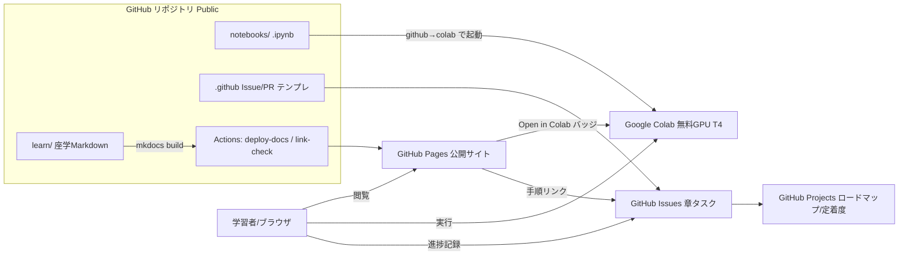
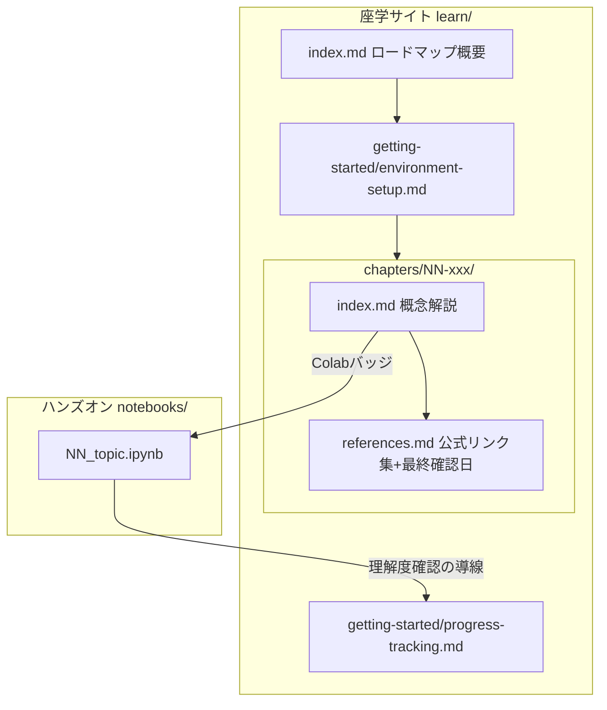
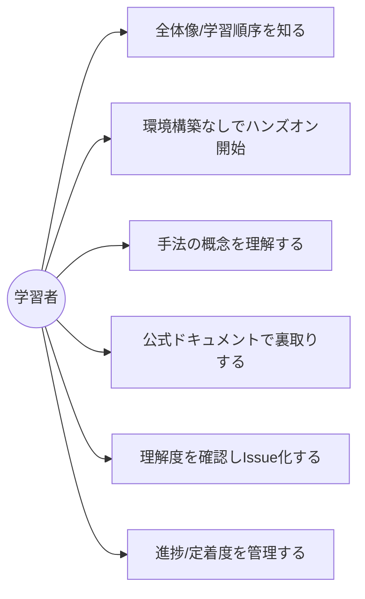
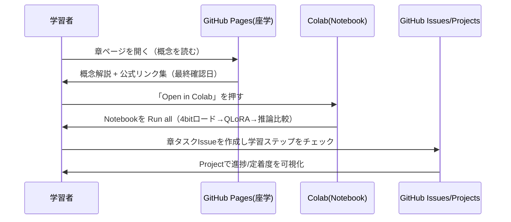
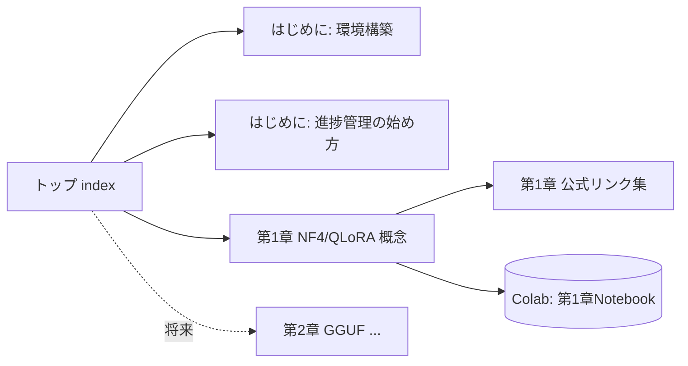
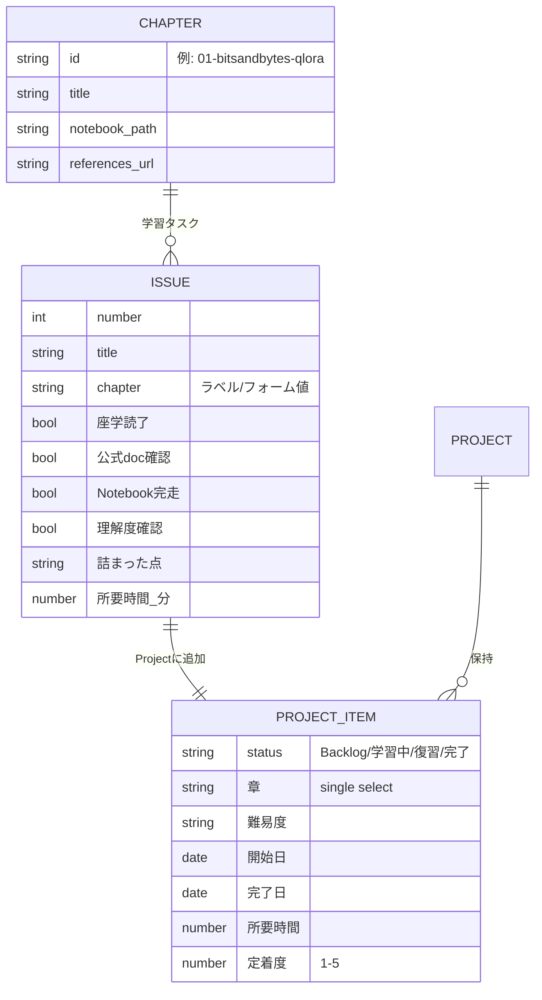

# 機能設計書（functional-design.md）

- 最終更新日: 2026-06-13
- ステータス: ドラフト（承認待ち）
- 関連: [product-requirements.md](product-requirements.md) ／ [architecture.md](architecture.md)

## 1. システム構成

学習者はブラウザだけで完結する。座学はGitHub Pages、ハンズオンはColab、進捗はGitHubで管理する。すべて1つのPublicリポジトリが供給源となる。

## 2. 機能ごとのアーキテクチャ

| 機能 | 実体 | 供給/公開経路 |
| :-- | :-- | :-- |
| 座学ドキュメント | `learn/**/*.md`（MkDocs Material） | Actions で build → GitHub Pages |
| ハンズオン教材 | `notebooks/NN_*.ipynb`（Python） | リポジトリ → Colab起動バッジ |
| 実行環境 | Google Colab（無料T4）/ 発展でローカル llama.cpp | バッジURLでgithubパスを直接Colabに展開 |
| 進捗管理 | GitHub Issues / Projects | Issueテンプレ＋手順書から学習者が運用 |
| 鮮度管理 | references.md（最終確認日）＋ link-check CI | Actions（lychee） |

## 3. コンポーネント設計

各章コンポーネントは必ず「概念(index.md)・公式リンク(references.md)・ハンズオン(.ipynb)・進捗(Issue)」の4点を1セットで持つ。

## 4. ユースケース

### 主要ユースケースフロー（1章の学習体験 = 4点セット）

## 5. 画面遷移（サイトナビ）

## 6. データモデル（進捗管理）

進捗は GitHub の Issue と Projects(v2) のフィールドで表現する。DBは持たない。

| 項目 | 表現場所 | 用途 |
| :-- | :-- | :-- |
| 学習タスク | Issue（chapter-task フォーム） | 章ごとの学習チェックリスト |
| ステータス | Project: Status | Board列（Backlog/学習中/復習/完了） |
| 章 | Project: 章(single select) | 章別フィルタ |
| 定着度 | Project: 定着度(1–5) | 復習要否の判断 |
| ロードマップ | Project: Roadmap ビュー | 学習計画の時間軸表示 |

## 7. API設計（将来連携）

現時点では外部APIを実装しない。将来の後付け候補のみ定義する。

| 連携先 | 方式 | 用途 | 状態 |
| :-- | :-- | :-- | :-- |
| Anki(AnkiConnect) | localhost HTTP | glossary用語のSRSカード化 | 後付け（設計余地のみ） |
| Notion API | REST | 進捗ダッシュボードのリッチ表示 | 後付け（任意） |
| Google Sheets API | REST/GAS | 学習時間の集計/可視化 | 後付け（任意） |

> いずれもMVP対象外。導線・拡張余地のみ確保する（[product-requirements.md](product-requirements.md) スコープ外参照）。
